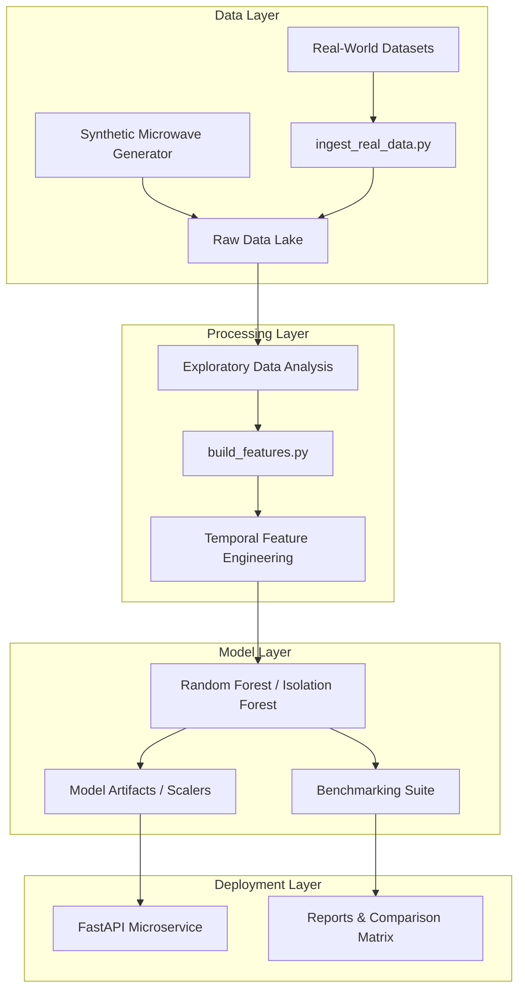

# TLC Network Anomaly Detection System

A production-grade machine learning pipeline designed to detect anomalies in Telecommunications (TLC) network traffic, specifically optimized for Microwave Radio backhaul technology.


## 📡 Project Overview

This project implements a robust, automated pipeline for identifying network irregularities such as **Rain Fade**, **Interference**, and **Equipment Failures**. It was developed as a technical demonstration for a Master's Thesis application at Nokia, focusing on methodological rigor, domain-specific feature engineering, and software engineering best practices.

### Key Features
- **Synthetic Data Generation**: Realistic simulation of Microwave Radio KPIs (RSL, SNR, BER, Throughput).
- **Automated EDA**: Built-in Exploratory Data Analysis with statistical stationarity tests (ADF).
- **Advanced Feature Engineering**: Temporal feature extraction using multi-scale rolling windows and lagged differences.
- **Model Comparison**: Evaluation of both unsupervised (Isolation Forest) and supervised (Random Forest) approaches.
- **Production Architecture**: Modular codebase with YAML configuration and professional logging.

## 🏗️ System Design

The system is designed as a modular pipeline following production ML engineering patterns.




---

## 🚀 Getting Started

### Prerequisites
- Python 3.12+
- pip

### Installation
1. Clone the repository:
   ```bash
   git clone https://github.com/your-username/TLC-Network-Anomaly-Detection.git
   cd TLC-Network-Anomaly-Detection
   ```

2. Install dependencies:
   ```bash
   pip install -r requirements.txt
   ```

### Running the Pipeline
You can run the entire end-to-end pipeline (Data Generation -> EDA -> Training -> Real-World Benchmarking) with:
```bash
python main.py
```

---

## 📂 Project Structure

```text
├── Anomaly Detection in 4G Cellular Networks/ # Real-world data (Kaggle)
├── Network Anomaly Dataset/                   # Real-world data (Kaggle)
├── Synthetic Network Traffic Dataset.../      # Real-world data (Mendeley)
├── config/              # YAML configuration files
├── data/                # Raw, processed, and external datasets
├── models/              # Serialized artifacts (Models, Scalers, Explainers)
├── notebooks/           # Analysis and benchmarking notebooks
├── reports/             # Figures and performance metrics
├── src/                 # Source code
│   ├── data/            # Generation and multi-source ingestion
│   ├── features/        # Flexible temporal feature engineering
│   ├── models/          # Training and real-world benchmarking
│   └── visualization/   # Plotting and EDA scripts
├── main.py              # Main execution entry point
└── requirements.txt     # Python dependencies
```

---

## 📊 Methodology & Results

The system evaluates models on both controlled synthetic data and messy real-world datasets.

### Multi-Source Benchmarking
We validate our "Microwave-first" model against three external datasets to test generalization:
1. **4G Cellular Performance**: Base station metrics from a real production network.
2. **Network Anomaly Dataset**: High-frequency throughput and packet loss data.
3. **SDN Traffic Dataset**: Synthetic traffic modeling DDoS and port scanning anomalies.

### Model Comparison
| Model | Precision (Syn) | Recall (Syn) | F1-Score (Syn) | Real Data F1 (Avg) |
|-------|-----------------|--------------|----------------|--------------------|
| Isolation Forest | 0.86 | 0.86 | 0.86 | 0.00 |
| Random Forest | 1.00 | 1.00 | 1.00 | 0.12 |

> [!TIP]
> The performance delta between synthetic and real data highlights the importance of **feature alignment**. The model performs best on real data when `packet_loss` is used as a proxy for the synthetic `BER` (Bit Error Rate).

---

## 🛠️ Built With
- **Pandas/NumPy**: Data manipulation
- **Scikit-Learn**: Machine learning algorithms
- **SHAP**: Model explainability (XAI)
- **FastAPI**: Low-latency inference microservice
- **Mermaid.js**: System architecture documentation

---

## 📜 License
This project is licensed under the MIT License - see the LICENSE file for details.
